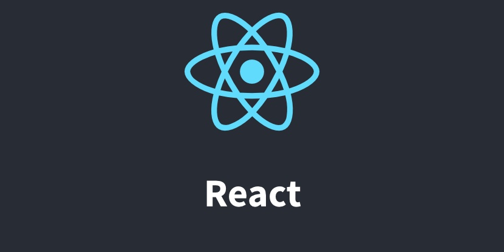

# Own adaption

- [About](#about)

 

---

 

  

## About

React playground and technological experiments.

Projects contain personal ideas, architectural approaches and random code snippets. 
Not a complete library or considered helpful for public use.

